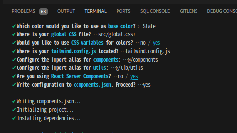

# social media app

_Not Next.js_
(使うレポジトリちゃうくね?)

- appwrite (free tier)
- react query ( tanstack )
- react context API
- tailwindcss
- react router with outlet

## vite setup

```sh
npm create vite@latest ./ # select TS
npm i
rm -rf src/ # 一旦すべて削除
```

main.tsx

```tsx
import ReactDOM from "react-dom/client";
import App from "./App";

ReactDOM.createRoot(document.getElementById("root")!).render(<App />);
```

App.tsx

```tsx
// rafce

const App = () => {
  return <div>App</div>;
};

export default App;
```

- tailwindcss with vite

[vite setup](https://tailwindcss.com/docs/guides/vite)

```sh
npm install -D tailwindcss postcss autoprefixer tailwindcss-animate
npx tailwindcss init -p
```

### react router

```sh
npm install react-router-dom
```

### shadcn/ui

[vite](https://ui.shadcn.com/docs/installation/vite)

```sh
npm i -D @types/node
npx shadcn-ui@latest init # 選択は下記の画像の通り
npx shadcn-ui@latest add button
npx shadcn-ui@latest add form
npx shadcn-ui@latest add input
npx shadcn-ui@latest add toast # pop-up message
```

app/ ではなくて、src/なので注意


### appwrite

```sh
npm i appwrite
```

- DB: collections relationship

下記はどちらも two-way relationship


- users(like) <-> posts(liked)


- caption


- index caption


Users の imaageId は、profile 画像を削除するために必要
